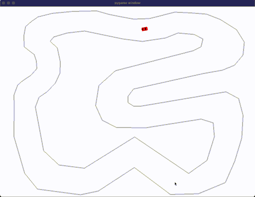
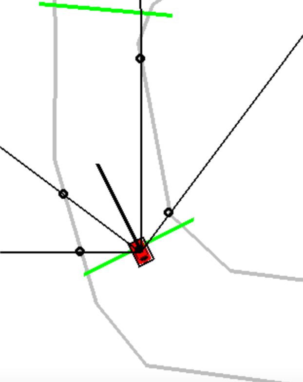

# Self driving car with Reinforcement Learning

This project is a car simulation game built with Pygame, featuring an AI-driven car that learns to navigate through a custom track using Deep Q-Learning. The AI can be trained or loaded from a pre-trained model to drive the car around the track. The project includes features for track creation, car physics, and AI training using reinforcement learning.

## Features

- **Custom Track Creation**: Users can manually create tracks and checkpoints by clicking on the screen.
- **AI-Controlled Car**: The car can be controlled by an AI agent that learns from interactions with the environment.
- **Reinforcement Learning**: The AI uses a Deep Q-Learning model implemented with Keras to learn optimal driving strategies.
- **Collision Detection**: The car detects collisions with track boundaries and checkpoints.
- **Hitbox and Raycasting**: The car uses raycasting sensors to perceive the environment, detecting distances to the track boundaries.
- **Customizable Game Settings**: Various settings such as screen size, car speed, and AI parameters can be adjusted.

## Installation

To run this project, you need to have Python 3.x installed along with the following packages:

- Pygame
- Numpy
- Keras
- TensorFlow
- Gym
